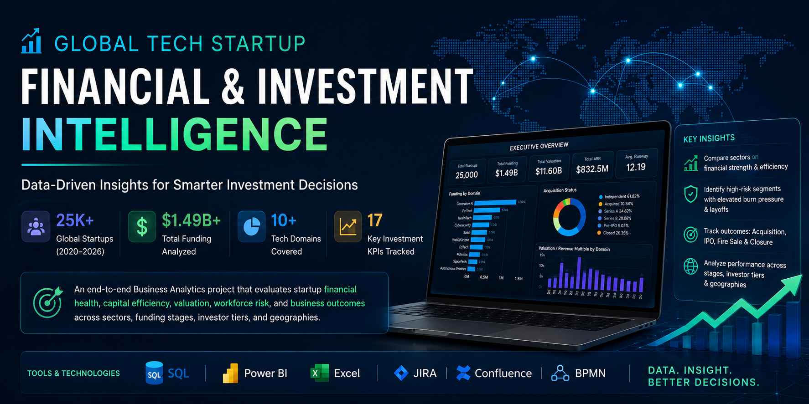
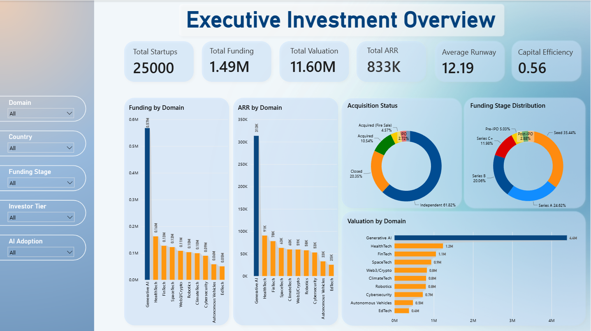
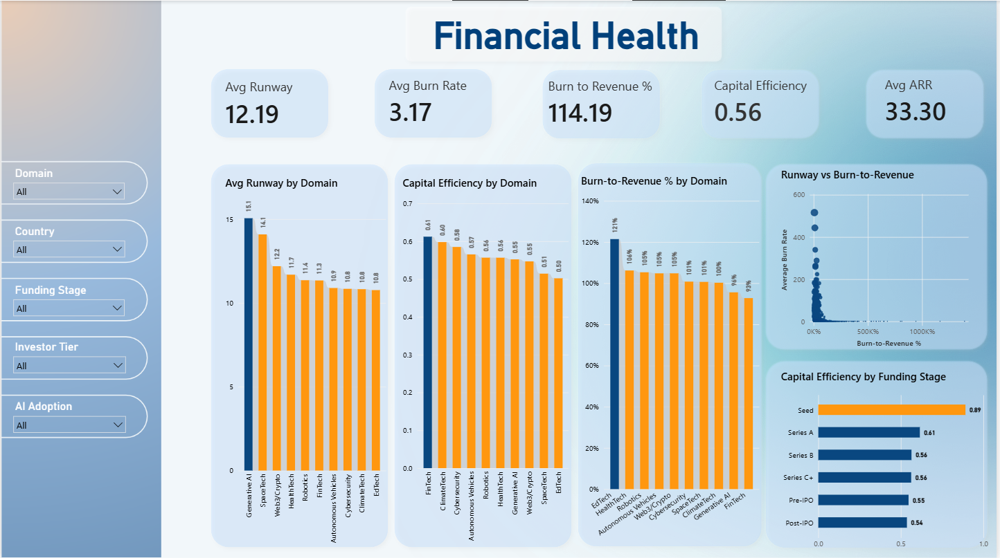
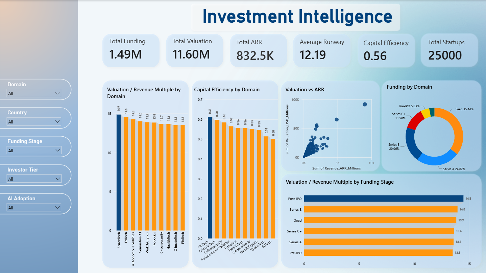
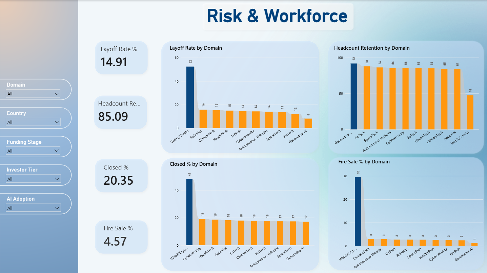
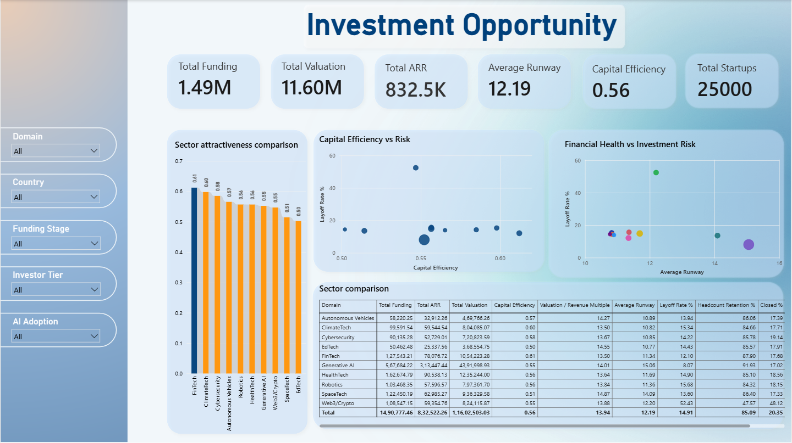

<p align="center">
  
</p>

# 🚀 Global Tech Startup Financial & Investment Intelligence

<p align="center">


</p>

---

## 📌 Project Overview

**Global Tech Startup Financial & Investment Intelligence** is an end-to-end Business Analytics portfolio project analyzing **25,000 technology companies** across global markets.

This project simulates a full institutional Venture Capital (VC) & Private Equity (PE) analytical engagement. It covers the entire Business Analyst lifecycle—from business problem framing and requirement gathering (BRD & FRD) to SQL metric engineering, dimensional Power BI modeling, and investment due diligence recommendations[cite: 3, 4, 5].

The solution provides investment committees, venture partners, and portfolio managers with a centralized intelligence platform to assess capital efficiency, monitor cash burn and runway, detect valuation premiums, and evaluate workforce risk.

---

# 📑 Table of Contents

- [Project Overview](#-project-overview)
- [Business Problem](#-business-problem)
- [Project Objectives](#-project-objectives)
- [Solution Approach](#️-solution-approach)
- [Project Workflow](#-project-workflow)
- [Project Deliverables](#-project-deliverables)
- [Tech Stack](#-tech-stack)
- [Dataset Overview](#-dataset-overview)
- [Data Model](#️-data-model)
- [Dashboard Pages](#-dashboard-pages)
- [Dashboard Preview](#-dashboard-preview)
- [Key Business Insights](#-key-business-insights)
- [Strategic Recommendations](#-strategic-recommendations)
- [Repository Structure](#-repository-structure)
- [How to Run](#-how-to-run)
- [About Me](#-about-me)

---

# 🎯 Business Problem

Venture capital and private equity investment teams currently lack a consolidated analytical view of startup valuation, revenue performance, capital efficiency, financial runway, and workforce risk across global technology segments.

Key business challenges include:
- **Capital Allocation Inefficiency:** Difficulty evaluating whether capital is being utilized efficiently to drive annual recurring revenue (ARR).
- **Valuation & Due Diligence Risk:** Inability to isolate sectors with extreme valuation-to-revenue multiples that require rigorous scrutiny.
- **Portfolio & Solvency Risk:** Lack of visibility into cash burn rates, short runway horizons, and workforce downsizing across market cycles.
- **Sector Vulnerability:** Identifying which startup verticals offer resilience versus segments experiencing high distress and operational failure.

---

# 🎯 Project Objectives

The primary objectives of this project were to:

- Aggregate and evaluate 25,000 technology startups across funding, valuation, ARR, runway, and layoffs.
- Engineer core venture metrics in SQL, including **Capital Efficiency**, **Burn-to-Revenue %**, **Valuation Multiples**, and **Headcount Retention**.
- Structure end-to-end documentation through a **Business Requirements Document (BRD)** and **Functional Requirements Document (FRD)**.
- Develop an interactive, multi-page Power BI intelligence suite with dynamic cross-filtering.
- Deliver data-driven recommendations to help investment committees prioritize sectors for capital deployment and due diligence.

---

# 🛠️ Solution Approach

The project was executed across a structured 9-stage Business Analytics framework:

1. **Business Understanding & Scoping:** Defined investment risks, core metrics, and stakeholder goals.
2. **Requirements Documentation:** Authored a complete BRD (MoSCoW prioritized) and FRD (with JIRA-style user stories).
3. **Data Quality & Validation:** Screened the 25,000-record dataset for missing values, distribution anomalies, and metric consistency.
4. **SQL KPI Engineering:** Calculated baseline venture capital metrics and outcome rates using Microsoft SQL Server.
5. **Data Modeling:** Built a dimensional Star Schema in Power BI for optimal DAX execution.
6. **Dashboard Development:** Designed a 4-page UI suite spanning Executive KPIs, Financial Health, Valuation Multiples, and Risk Radars.
7. **Business Reporting:** Synthesized findings into executive-level investment insights and due diligence strategies.

---

# 🔄 Project Workflow

```text
Business Problem Scoping
        │
        ▼
Business Requirements Document (BRD)
        │
        ▼
Functional Requirements Document (FRD)
        │
        ▼
SQL Metric Engineering & Aggregation
        │
        ▼
Power BI Star Schema Data Modeling
        │
        ▼
DAX KPI Calculations
        │
        ▼
Interactive Executive Dashboards
        │
        ▼
Investment Insights & Recommendations

```

# 📦 Project Deliverables

This repository contains all artifacts developed across the 9-stage Business Analytics lifecycle:

| Deliverable | Description |
|-------------|-------------|
| 📄 Business Requirements Document (BRD) | Formal documentation defining the business problem, stakeholder matrix, MoSCoW-prioritized requirements, scope, and project success criteria. |
| 📄 Functional Requirements Document (FRD) | Technical and functional translation of business needs featuring structured JIRA-style user stories and acceptance criteria. |
| 💻 SQL Analytics & Metric Engine | Production-ready SQL scripts executing aggregations, venture KPI engineering (Capital Efficiency, Burn Multiples), and cohort segmentation. |
| 📊 Interactive Power BI Dashboard | Multi-page enterprise reporting solution covering Macro Investment Trends, Financial Health, Valuation Multiples, and Risk Radars. |
| 📑 Final Executive Business Report | Comprehensive synthesis of quantitative findings, sector risk categorizations, and capital allocation recommendations. |

---

# 💻 Tech Stack

| Category | Tools & Technologies |
|----------|----------------------|
| Database Engine | Microsoft SQL Server |
| Query Language | SQL (Data Aggregation, Type Casting, Window Functions, NULL Handling) |
| Business Intelligence | Microsoft Power BI Desktop & Power BI Service |
| Analytical Modeling | DAX (Data Analysis Expressions), Star Schema Architecture |
| Business Analysis | Requirements Gathering, BRD/FRD Authoring, MoSCoW Prioritization, JIRA User Stories |
| Version Control | Git & GitHub |

---

# 📂 Dataset Overview

The underlying dataset tracks **25,000 global technology companies** across the 2020–2026 venture funding, generative AI boom, and subsequent market contraction cycles.

| Field Name | Type | Description |
|------------|------|-------------|
| `Company_ID` | Dimension | Unique alphanumeric identifier for each startup entity |
| `Domain` | Dimension | Technology vertical (e.g., Generative AI, FinTech, Web3/Crypto, ClimateTech) |
| `Country` | Dimension | Headquarters location of the company[cite: 2] |
| `Funding_Stage` | Dimension | Investment stage (Seed, Series A, Series B, Series C+, Pre-IPO, Post-IPO) |
| `Investor_Tier` | Dimension | Institutional tier ranking of lead investors |
| `AI_Adoption` | Dimension | AI integration and utilization maturity level |
| `Acquisition_Status` | Dimension | Lifecycle outcome (Independent, Acquired, IPO, Closed, Acquired - Fire Sale) |
| `Total_Funding_USD_Millions` | Fact | Cumulative equity financing raised (USD Millions) |
| `Valuation_USD_Millions` | Fact | Most recent post-money company valuation (USD Millions) |
| `Revenue_ARR_Millions` | Fact | Annualized Recurring Revenue run-rate (USD Millions) |
| `Monthly_Burn_Rate_Millions` | Fact | Net monthly operational cash outflow (USD Millions) |
| `Runway_Months_2024` | Fact | Total operational cash runway in months |
| `Peak_Headcount_2023` | Fact | Maximum full-time employee headcount during market peak |
| `Layoffs_2024_2025` | Fact | Cumulative workforce reduction count |
| `Current_Headcount_2026` | Fact | Active retained headcount |

---

# 🗄️ Data Model

The data architecture in Power BI is organized using an optimized **Star Schema** to ensure fast query performance and clean DAX calculations:

- **Fact Table:** `GTS` houses core financial metrics (Funding, Valuation, ARR, Burn Rate, Runway, Headcount, Layoffs).
- **Dimension Attributes:** Categorical slicing across `Domain`, `Country`, `Funding Stage`, `Investor Tier`, `AI Adoption`, and `Acquisition Status`.
- **Core Explicit DAX Measures:**
  - $\text{Capital Efficiency} = \frac{\sum \text{Revenue ARR}}{\sum \text{Total Funding}}$
  - $\text{Valuation/Revenue Multiple} = \frac{\sum \text{Valuation}}{\sum \text{Revenue ARR}}$
  - $\text{Burn-to-Revenue \%} = \frac{\sum \text{Monthly Burn} \times 12}{\sum \text{Revenue ARR}} \times 100$
  - $\text{Layoff Rate \%} = \frac{\sum \text{Layoffs}}{\sum \text{Peak Headcount}} \times 100$
  - $\text{Headcount Retention \%} = \frac{\sum \text{Current Headcount}}{\sum \text{Peak Headcount}} \times 100$


---

# 📊 Dashboard Overview

The Power BI analytical suite is organized into four dedicated reporting pages designed to address specific executive and investment due diligence questions:

| Dashboard Page | Target Business Focus | Key Visuals & Analysis |
|----------------|-----------------------|------------------------|
| 📊 **Executive Investment Overview** | High-level portfolio tracking and market concentration. | Total Funding, Valuation, ARR, Outcome Distributions, and Stage Concentration. |
| 🩺 **Financial Health** | Solvency, cash consumption, and operational runway. | Average Runway by Domain, Capital Efficiency, Burn-to-Revenue %, and Runway vs. Burn scatter plot. |
| 💡 **Investment Intelligence** | Valuation efficiency and risk-adjusted pricing multiples. | Valuation-to-Revenue Multiple by Domain/Stage, Valuation vs. ARR scatter, and Efficiency rankings. |
| 🛡️ **Risk & Workforce** | Downside exposure, downsizing patterns, and distressed outcomes. | Layoff Rate %, Headcount Retention %, Closed Rate %, and Fire Sale % by Sector. |

---

# 📊 Dashboard Overview

The Power BI analytical suite is organized into five dedicated reporting pages designed to address specific executive and investment due diligence questions:

| Dashboard Page | Target Business Focus | Key Visuals & Analysis |
|----------------|-----------------------|------------------------|
| 📊 **Executive Investment Overview** | High-level portfolio tracking and market concentration. | Total Funding, Valuation, ARR, Outcome Distributions, and Stage Concentration. |
| 🩺 **Financial Health** | Solvency, cash consumption, and operational runway[cite: 2, 4]. | Average Runway by Domain, Capital Efficiency, Burn-to-Revenue %, and Runway vs. Burn scatter plot. |
| 💡 **Investment Intelligence** | Valuation efficiency and risk-adjusted pricing multiples. | Valuation-to-Revenue Multiple by Domain/Stage, Valuation vs. ARR scatter, and Efficiency rankings. |
| 🛡️ **Risk & Workforce** | Downside exposure, downsizing patterns, and distressed outcomes. | Layoff Rate %, Headcount Retention %, Closed Rate %, and Fire Sale % by Sector. |
| 🎯 **Investment Opportunity** | Sector benchmarking and risk-adjusted opportunity matrix. | Capital Efficiency vs. Risk scatter, Financial Health vs. Investment Risk matrix, and full Sector Comparison Table. |

---

# 📸 Dashboard Preview

## 📊 1. Executive Investment Overview

<p align="center">
  
</p>

---

## 🩺 2. Financial Health

<p align="center">
  
</p>

---

## 💡 3. Investment Intelligence

<p align="center">
  
</p>

---

## 🛡️ 4. Risk & Workforce

<p align="center">
  
</p>

---

## 🎯 5. Investment Opportunity

<p align="center">
  
</p>

---

# 📈 Key Business Insights

The analytical workflow uncovered critical insights across capital distribution, operational runway, and sector stability:

### 🤖 Generative AI: Market Dominance & High Headcount Stability
- **Capital Magnet:** Generative AI commands **$0.57M in Total Funding** and **$4.4M in Total Valuation**, far exceeding all other technology sectors in the dataset.
- **Cash Runway:** Startups in this sector maintain an average operational runway of **15.06 months**.
- **Workforce Retention:** Displays the lowest industry layoff rate (**8.07%**) and the highest headcount retention (**91.93%**).

### 💰 Capital Efficiency Leaders vs. High-Burn Verticals
- **Top ARR Converters:** **FinTech (0.61)**, **ClimateTech (0.60)**, and **Cybersecurity (0.58)** lead all sectors in generating ARR per dollar of funding raised.
- **Cash Consumption Pressure:** **EdTech** displays a severe **121% Burn-to-Revenue ratio** and the lowest capital efficiency (**0.50**), highlighting heavy unit-economic friction.
- **Stage Discipline:** **Seed-stage companies** demonstrate the highest capital efficiency (**0.89**) compared to later rounds (Series C+ at **0.56**, Post-IPO at **0.54**).

### ⚠️ Web3 / Crypto: Elevated Volatility & Solvency Risk
- **Downsizing Exposure:** Suffered an industry-high **52.43% layoff rate** during the market downturn.
- **Failure Rates:** Records an unsustainable **48.12% closed rate** and a low headcount retention rate of only **47.57%**.

---

# 💡 Business Recommendations

Based on the quantitative findings, the following recommendations are provided for investment committees:

1. **Prioritize Capital in High-Efficiency Segments:** Allocate primary growth capital into **FinTech**, **ClimateTech**, and **Cybersecurity** due to their consistent ARR conversion efficiency and balanced burn metrics.
2. **Implement Valuation Screening on Generative AI:** Given the immense concentration of capital in Generative AI, apply rigorous valuation-to-ARR screening thresholds to mitigate paying inflated late-stage multiples.
3. **Establish Mandatory Runway Audits for High-Burn Sectors:** Require startups in **EdTech** and **HealthTech** to demonstrate clear unit-economic paths to a burn-to-revenue ratio below 100% prior to new funding disbursements.
4. **De-Risk & Structure Web3/Crypto Exposure:** Utilize senior liquidation preferences, structured debt, or milestone-based funding tranches to protect downside capital when evaluating Web3/Crypto opportunities.
5. **Incorporate BI Dashboards in Diligence Reviews:** Utilize interactive slice-and-dice dashboards during routine Investment Committee evaluations to benchmark target startup metrics against sector medians.

---

# 🎯 Skills Demonstrated

### Business Analysis
- Business Problem Scoping & Stakeholder Mapping
- Business Requirements Document (BRD) Authoring
- Functional Requirements Document (FRD) & User Story Backlog
- MoSCoW Feature Prioritisation
- Executive Investment Reporting

### SQL & Data Engineering
- Database Architecture & Aggregation Queries
- Mathematical Metric Engineering (Capital Efficiency, Burn Ratios)
- Type Casting, Percentage Formulations, & Conditional Logic (`CASE WHEN`)
- Query Performance Optimisation

### Power BI & Business Intelligence
- Star Schema Dimensional Modelling
- Complex Explicit DAX Measures
- Interactive Multi-Page UI/UX Design
- Dynamic Slicing & Drill-Through Capabilities
- Financial Data Visualization (Scatter, Doughnut, Multi-Bar Matrices)

---

# 📁 Repository Structure

```text
Global-Tech-Startup-Financial-Intelligence
│
├── 📄 README.md
├── 📁 00_Business_Problem_Statement
│   └── Business_Problem_Statement.docx
├── 📁 01_BRD
│   └── Business_Requirement_Document_BRD.docx
├── 📁 02_FRD
│   └── Functional_Requirement_Document_FRD.docx
├── 📁 03_SQL
│   └── GTS_SQL_Analysis.sql
├── 📁 04_Dataset
│   └── Global_Tech_Startups_25k.csv
├── 📁 05_PowerBI
│   └── GTS_Investment_Intelligence.pbix
├── 📁 06_Final_Report
│   └── Executive_Investment_Report.pdf
└── 📁 07_Images
    ├── 07_ImagesBanner.png
    ├── Dashboard1.png
    ├── Dashboard2.png
    ├── Dashboard3.png
    ├── Dashboard4.png
    └── Dashboard5.png

```

# 💼 Why This Project?

This portfolio piece was built to mirror a full-scale institutional analytics engagement from end to end. 

Rather than simply building isolated charts, this project validates the complete strategic toolkit of a modern Business Analyst: translating ambiguous market challenges into formal documentation (BRD/FRD), extracting rigorous quantitative proof using SQL, constructing an enterprise dimensional data model in Power BI, and delivering clear, boardroom-ready investment recommendations.

---

# ⚙️ How to Run

1. **Database Setup (SQL Server):**
   - Import the dataset from `04_Dataset/Global_Tech_Startups_25k.csv` into Microsoft SQL Server.
   - Execute the SQL scripts in `03_SQL/GTS_SQL_Analysis.sql` to run the metric calculations and validation queries.

2. **Power BI Dashboard:**
   - Open `05_PowerBI/GTS_Investment_Intelligence.pbix` in **Power BI Desktop**.
   - If prompted, update the data source settings to connect to your local dataset path.
   - Interact with the slicers and visual reporting views.

---

# 🚀 Future Improvements

- **Predictive Insolvency Modeling:** Developing machine learning classification models to predict startup closure probability based on burn rate and runway horizons.
- **Automated Data Pipelines:** Establishing automated ETL refresh schedules using Azure Data Factory and Power BI Service.
- **Geographic Capital Flow Analysis:** Expanding visual reporting into country-level capital flow heatmaps.

---

# 👨‍💻 About Me

Hi, I'm **Mrinal Sen Gupta**, an Aspiring Business Analyst with hands-on experience across SQL, Power BI, DAX, Data Modeling, BRD/FRD Authoring, and Strategic Business Analysis.

I specialize in bridging data engineering with business strategy—turning complex datasets into executive clarity and actionable decisions.

- 💼 **LinkedIn:** [MRINAL SEN GUPTA](https://www.linkedin.com/in/mrinal-sen-gupta-791606208/)
- 💻 **GitHub:** [senguptamrinal](https://github.com/senguptamrinal)
